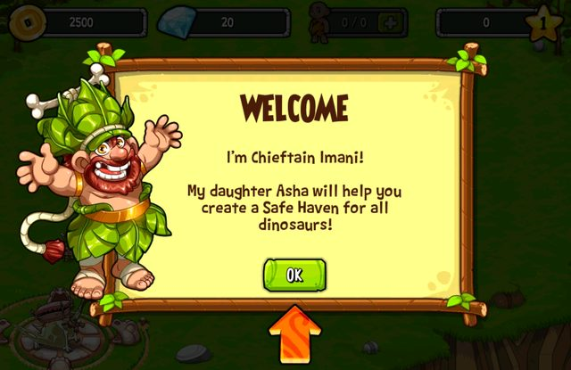
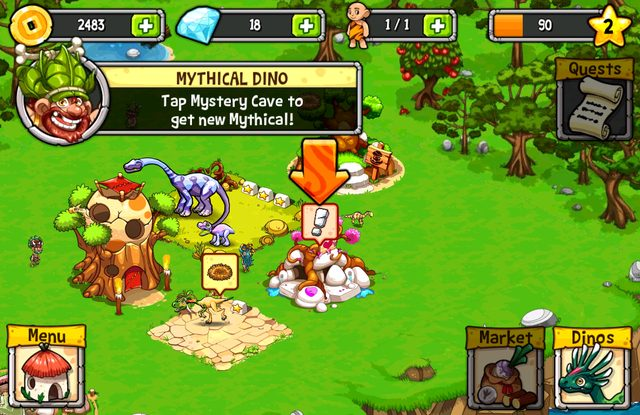
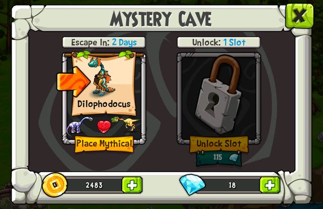
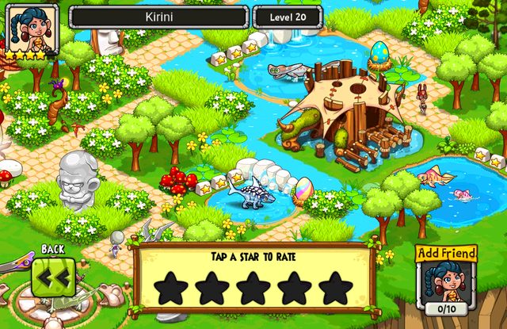
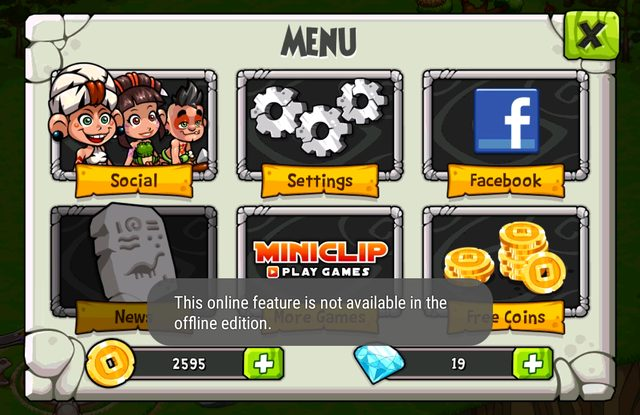
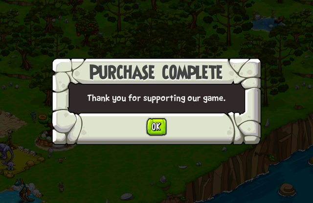
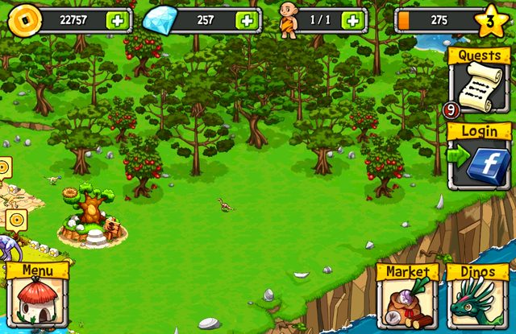
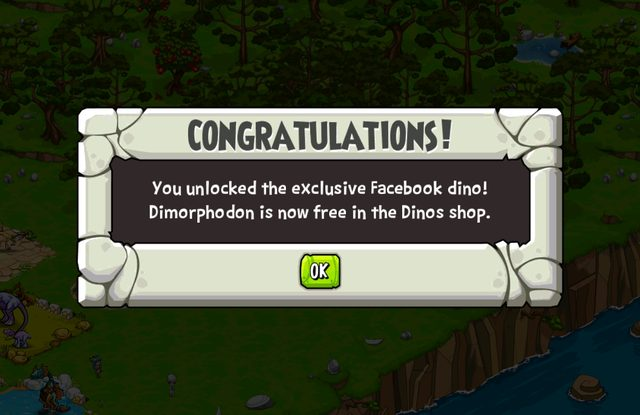
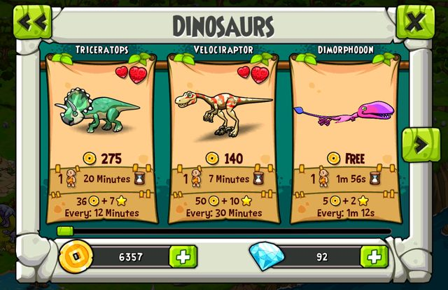

# Dino Pets — Offline Edition

Miniclip's **Dino Pets** for Android (version 1.1.4) has been discontinued and its
servers are gone; the original APK now crashes on its loading screen.  This
repository patches that APK so the complete game runs **without any network
connection or server**, with the original gameplay, progression, art and UI.
Coin and gem packs are granted locally for free, and the Facebook-exclusive
Dimorphodon is unlocked when the tutorial is over.



## Download

| | |
|---|---|
| **APK** | [`output/DinoPets-1.1.4-offline.apk`](output/DinoPets-1.1.4-offline.apk) |
| SHA-256 | `41abe8f755e2f30c8d9a0c483b8d110dc095bf1d28ef57e2caeabc3c0fce2fc4` |
| Package | `com.miniclip.dinopets` 1.1.4 (versionCode 13), minSdk 8, targetSdk 24 |
| Permissions | `VIBRATE` only (no internet permission at all) |
| Signing cert | `CN=Dino Pets Offline Edition`, SHA-256 `17f36394…ce7141` |

### Installing

1. The device must be able to run **32-bit ARM** apps: the game's native code is
   `armeabi` only.  Most Android phones and tablets can; some recent 64-bit-only
   phones (for example Pixel 7 and newer) cannot.
2. If the original Play Store version is installed, uninstall it first.  The
   signature differs, so Android will not install over it.  If you want to keep
   that progress and your device is rooted, copy
   `/data/data/com.miniclip.dinopets/files/Contents/Resources/Documents/save.plist`
   out before uninstalling and back afterwards.  The offline edition uses the same
   file and format.
3. Install the APK (sideload, or `adb install DinoPets-1.1.4-offline.apk`).
   Android 14–17 accept it; it targets API 24, the minimum those versions allow.
   It installs over earlier builds of this offline edition and keeps their save
   (same signing key).

The first launch takes a little longer while the game builds its world from the
bundled configuration.  Airplane mode is fine.

## What works offline

| Feature | Originally needed | Offline edition |
|---|---|---|
| Startup | mandatory config download, NTP time, cloud save, remote setup | bundled configuration (all 75 dinos, 20 mythicals, 30 levels, 171 quests, decorations, expansions, shops) and the device clock; starts with no network |
| Progress: coins, gems, XP, levels, dinos, buildings, quests, unlocks | local save + cloud backup | local save every 60 s and when the app goes to the background; survives restarts and app updates |
| Timers: building, hatching, breeding, shop income, daily rewards | NTP-verified time | device clock; timers keep running while the game is closed |
| Visiting other shelters | social server | the 5 bundled community shelters (Kirini, AlexGrant, Gertrudes, Philosoraptor, MrFabulous) can be visited, rated and added as friends |
| Reminder notifications ("Visit Park", …) | local alarms | kept, and fixed so they appear on Android 6.0+ |
| Buying coins/gems (Google Play and GetJar store tabs) | Play Store / GetJar billing and Miniclip receipt validation | **free and local**: tapping a pack completes it at once with the game's own "Purchase complete" pop-up, and the pack's original amount (times the game's level multiplier) is added and saved |
| Facebook-exclusive dino (Dimorphodon, the "Login to Facebook" quest reward) | Facebook login | **unlocked automatically** once the tutorial is finished, with a "Congratulations!" pop-up; then free in the Dinos shop like any other dino.  Granted once per save; older saves that already finished the tutorial get it the next time the map opens |
| Facebook login/share/like, News, More Games, Terms, Rate | Facebook / Miniclip servers | a short "not available in the offline edition" message; nothing hangs |
| Other players by Dino ID, messages | social server | not available (there are no other players); the game reports it normally |
| Ads, analytics, attribution, push | 3rd-party servers | removed |

<p>








</p>

## How it was tested

On an Android 7.1.1 ARM emulator in airplane mode with no active network:

* The original APK crashes on its loading screen.
* The offline APK installs, launches and reaches gameplay from a clean install.
* Played through the tutorial and core loop: homes, nests, eggs, Hatchery,
  keeper hut, level-up, Mystery Cave, and breeding a mythical hybrid.
* Force-stopped and relaunched several times; the state comes back exactly,
  checked against the decrypted save file.  A breeding timer finished while
  the app was closed.
* Exercised every online entry point (store, Facebook, social tabs, add by
  Dino ID, community visit, rating, settings links, notifications).  None
  hangs or crashes, and logcat shows no fatal errors.
* Bought gem and coin packs through both store tabs (Google Play: 20 gems,
  240 gems, 3800 coins, 20200 coins; GetJar: 55 gems).  Each completed at once
  and the new totals were in the decrypted save; on the final APK they were
  unchanged after a force-stop and relaunch.
* Finished the tutorial on a fresh install: the Dimorphodon unlock pop-up
  appears right after it, the dino is free in the shop, and it was placed,
  built and inaugurated like any other dino.  Relaunching does not grant it
  again.  A save that had finished the tutorial before this feature existed
  got the unlock (once) when the map opened.

Details, including every server endpoint and how each was handled, are in
[docs/ANALYSIS.md](docs/ANALYSIS.md).

## Known limitations

* Needs 32-bit ARM support (see *Installing*).
* No real Facebook login, and no features that involved other real players.
* The game trusts the device clock: changing the date or time affects timers.
* Content is what shipped inside 1.1.4 (configuration version 1.1.2).  Any later
  server-side content updates can't be recovered.

## Building it yourself

Requirements: Linux, Java 17+, Python 3, `curl`, `unzip`, and ARM binutils
(`apt install binutils-arm-linux-gnueabi`).

```sh
tools/fetch_tools.sh          # apktool, baksmali, Android build-tools + platform into ./.tools
./build.sh                    # downloads the original APK from the v1.0.0-offline release
# or: ./build.sh path/to/Dino.Pets_1.1.4.apk
```

`build.sh` checks the original APK's SHA-256, decodes it, applies the patches
under `patches/`, rebuilds, aligns and signs it, and writes
`output/DinoPets-1.1.4-offline.apk`.  Every patch verifies the exact original
bytes first, so it refuses to modify anything else.  `DEBUG=1 ./build.sh` also
sends the game's internal log to logcat (tag `DinoNSLog`).

**Signing:** when `signing/dinopets-offline.keystore` doesn't exist, the build
creates a new key.  It is deliberately not committed.  Android only accepts an
update signed with the same key as the installed app, and uninstalling first
deletes the save.  To build an update for an existing installation, sign with
the key that built it:
`KEYSTORE=/path/to/dinopets-offline.keystore ./build.sh`.

## Repository layout

| Path | Contents |
|---|---|
| `build.sh` | full rebuild pipeline |
| `patches/native/patch_libgame.py` | binary patches for `libgame.so` (startup, time, cloud save, polling, Facebook dino unlock) |
| `patches/smali/patch_smali.py` | Java-layer patches (NTP, ping, local purchases, Facebook, analytics, notifications) |
| `patches/java/src/` | `com.miniclip.offline.Offline`, the local replacements those patches call |
| `patches/manifest/patch_manifest.py` | offline manifest (no network permissions or SDK components), targetSdk 24 |
| `tools/fetch_tools.sh` | downloads the build tools |
| `tools/dpcrypt.py` | decrypt/encrypt the game's save and config files: `dpcrypt.py dec libgame.so save.plist save.xml` |
| `tools/objc_parse.py` | dumps Objective-C classes and methods from `libgame.so` (used to locate the patch sites) |
| `docs/ANALYSIS.md` | network dependency inventory, patch list, file formats, verification |
| `output/` | the rebuilt APK |

Dino Pets and all its content are © Miniclip.  This is an unofficial
preservation patch, not affiliated with Miniclip.
